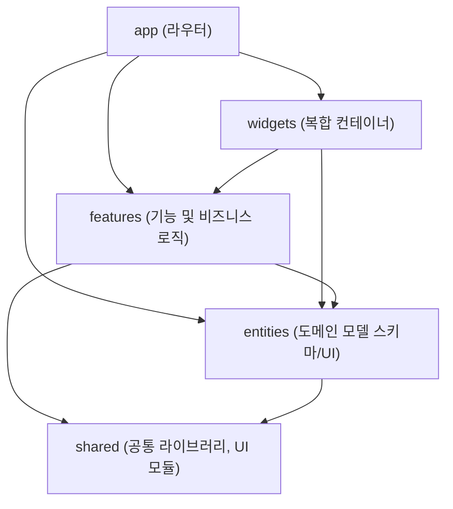

# 01. FSD 기반 프론트엔드 아키텍처 레퍼런스

이 문서는 프론트엔드 프로젝트에서 Next.js App Router와 Feature-Sliced Design(FSD) 아키텍처를 결합하여 사용할 때의 상세 가이드를 제공합니다.

## 1. 디렉터리 구조 및 레이어 (계층)

FSD는 기능(Feature)과 도메인 모델(Entity)을 분리하여 확장성과 유지보수성을 극대화합니다.

- **`app/` (Next.js 라우터 & 진입점)**
  - `(group)/[page]/page.tsx`, `layout.tsx` 등 엔드포인트 라우팅 담당.
  - 전역 상태 공급자(`Providers`), 전역 스타일 임포트 등이 위치합니다.
- **`widgets/` (선택적 사용, 복합 UI)**
  - 여러 `features`와 `entities`를 조합하여 독립적인 큰 UI 블록(예: 네비게이션 바, 메인 대시보드 구조)을 만듭니다.
- **`features/` (비즈니스 요구사항 기능)**
  - "로그인하기", "검색 폼 제출하기", "장바구니 담기" 등 사용자가 시스템과 상호작용하는 구체적인 동작(action)들의 묶음입니다.
  - 폴더 구조 예시:
    - `features/[feature-name]/ui/` : 기능 UI 컴포넌트
    - `features/[feature-name]/model/` : 비즈니스 로직, 상태(`use[Feature]ViewModel.ts`), API Hook
    - `features/[feature-name]/api/` : 해당 기능에만 국한된 API 호출 (필요시)
- **`entities/` (비즈니스 도메인 모델)**
  - 서버에서 내려오는 핵심 데이터 모델과 이를 순수하게 보여주기만 하는 UI(`dumb components`).
  - 예시: `User`, `Product`, `Order`, `Report`.
  - 이곳에는 복잡한 액션 상태(예: 폼의 입력 후 제출)를 두지 않습니다.
- **`shared/` (인프라 및 재사용 컴포넌트)**
  - `shared/ui/`: shadcn/ui 등 프로젝트 전반에서 재사용되는 UI 컨테이너 (버튼, 카드 등).
  - `shared/api/`: 백엔드 진입점(Axios 인스턴스, 공통 Response 타입).
  - `shared/lib/` (또는 `utils/`): `cn()` 같은 유틸 함수.

## 2. 모듈 간 의존성 방향 (엄격한 규칙)

의존성(`import`)은 **가장 바깥쪽(`app`)에서 0 계층(`shared`) 방향으로만 허용**됩니다. (단방향 의존성)

## 3. ViewModel 기반의 로직 분리

React/Next.js 컴포넌트 내부에 비대해진 상태값과 부수 효과(`useEffect`)를 남겨두지 마십시오. 모든 비즈니스 판단과 상태 변경은 ViewModel로 분리합니다.

- **뷰 영역 (`features/.../ui/FeatureComponent.tsx`)**:
  - 오직 UI 렌더링에만 집중합니다.
  - `onClick={viewModel.actions.handleSubmit}` 과 같이 액션을 바인딩합니다.
- **로직 영역 (`features/.../model/useFeatureViewModel.ts`)**:
  - `useState`, API 콜, 데이터 정제 등을 수행하고 순수한 상태(State)와 행위(Action) 묶음을 View로 리턴합니다.
