# 외식업 창업 생존 내비게이션 『장사방패』 통합 온보딩 및 UX 플로우

본 문서는 **최종 서비스 기획서(PRD)**를 바탕으로 설계된, "감과 로망"을 배제하고 "데이터와 시스템"을 강제하는 하이브리드 UX 플로우입니다.

## 1. 극강의 현실 직시 6단계 UX 플로우 다이어그램

```mermaid
graph TD
    A[랜딩 페이지 / 앱 실행] --> B{유저 진입}
    B -->|신규 생성| ST_01[Phase 1: 온보딩 & 세팅\n자본금, 타겟, 아이템, D-Day 설정]
    
    %% Phase 2: 시뮬레이터
    ST_01 --> ST_02[Phase 2: 팩트폭행 생존 시뮬레이터]
    subgraph Phase 2: Reality Check
    ST_02_1(초기 자본 분배기 - 30% 룰 적용) --> ST_02_2(진짜 마진 & BEP 역산기)
    ST_02_2 --> ST_02_OUT[안전 월세선 및 필요 매출 가이드라인 획득]
    end
    ST_02 --> ST_02_1
    ST_02_OUT --> ST_03

    %% Phase 3: 상권 임장
    ST_03[Phase 3: 입체적 상권 분석 & 발품 임장]
    subgraph Phase 3: Location & Field
    ST_03_1(타겟 핏 진단 - 궁합도 분석) --> ST_03_2{매물 현장 접근<br>GPS 연동}
    ST_03_2 -->|접근 완료| ST_03_3(시크릿 임장 체크리스트 오픈)
    end
    ST_03 --> ST_03_1
    ST_03_3 --> ST_04

    %% Phase 4: 계약 방어
    ST_04[Phase 4: AI 계약 방어기]
    subgraph Phase 4: Contract Defense
    ST_04_1(부동산 기싸움 챗봇 스크립트) --> ST_04_2(상가 임대차 계약서 OCR 스캔)
    ST_04_2 --> ST_04_3[독소조항 경고 및 수정]
    end
    ST_04 --> ST_04_1
    ST_04_3 --> ST_05

    %% Phase 5: 오픈 준비
    ST_05[Phase 5: D-Day 역산 동적 체크리스트]
    subgraph Phase 5: Action Task
    ST_05_1(선행 조건 잠금 해제 방식 퀘스트) --> ST_05_2(제휴 파트너 매칭 / 관공서 다이렉트 패스)
    end
    ST_05 --> ST_05_1
    ST_05_2 --> ST_06

    %% Phase 6: 운영 모드
    ST_06[Phase 6: 운영 모드 전환]
    subgraph Phase 6: Maintenance
    ST_06_1(일일 세무/노무 알림) --> ST_06_2(안전 마진 유지 상태 모니터링)
    end
    ST_06 --> ST_06_1
```

## 2. 각 단계별 핵심 UI/UX 전략

### Phase 1: 온보딩 & 세팅
- **목적:** 유저 프로파일링 및 필수 변수(Variables) 획득
- **입력 리스트:** 총 가용 자본금, 타겟 고객층(연령/성별), 희망 아이템, 예상 오픈일(D-Day).
- **UX 포인트:** 입력 과정을 지루한 폼(Form) 형식이 아닌, 챗봇과 대화하듯 한 화면에 한 가지 질문만 던지는 'One Thing Per Screen' 방식 채택.

### Phase 2: 팩트폭행 생존 시뮬레이터 (Reality Check)
- **목적:** 상가 매물을 보러 가기 전, '내가 감당할 수 있는 한계선'을 데이터로 못 박기.
- **기능 1 (자본 분배기):** 입력한 8,000만 원 중 무조건 30%(2,400만 원)를 '예비비(여유자금)'로 락인(Lock-in)시켜 시각화. 
- **기능 2 (마진 역산기):** 객단가, 배달 수수료, 재료비를 입력받아 '가게 월세 150만 원을 내려면 하루에 몇 그릇을 팔아야 하는가?'를 역산하여 팩트 제공.
- **Output:** "사장님의 안전 월세선은 150만 원 이하입니다." 라는 가이드라인 확정.

### Phase 3: 입체적 상권 분석 & 발품 임장 (Location & Field)
- **목적:** 서류상 분석이 아닌 '현장 중심'의 하이브리드 검증.
- **기능 1 (데이터 진단):** 관심 지역 지정 시, Phase 1에서 설정한 타겟고객(예: 2030 여성)과의 매칭률(궁합도) 제공.
- **기능 2 (GPS 임장 퀘스트):** 해당 상가 반경 50m 진입 인증 시, "주방 닥트 설치 공간 확인", "가게 앞 경사도" 등 실전 오프라인 체크리스트 해제.

### Phase 4: AI 계약 방어기 (Contract Defense)
- **목적:** 계약 직전, 불리한 조항으로 인한 치명적 손실 차단.
- **기능:** 임대차 계약서 촬영 시 AI가 OCR로 스캔하여 '원상복구 범위', '특약사항 이면 합의' 등 독소조항 하이라이트 및 수정 권고안 제시. 부동산 중개인과의 대화 스크립트(체크포인트) 제공.

### Phase 5: D-Day 역산 동적 체크리스트 (Action Task)
- **목적:** 복잡한 행정 절차와 오픈 준비를 게임 퀘스트처럼 설계하여 실행력 극대화.
- **방식:** D-Day 기준 역방향으로 일정 제시. 반드시 "A(예: 위생교육)"를 완료해야 "B(예: 영업신고)" 퀘스트가 열리는 '종속성(Dependency)' 구조.
- **BM 연계:** 포스기, 인테리어 등 검증된 B2B 파트너사를 퀘스트 중간에 배치하여 리드 제너레이션(Lead Gen).

### Phase 6: 운영 모드 (사후 관리)
- **목적:** 오픈 후 앱 이탈 방지(Retention) 및 LTV 극대화.
- **기능:** 오늘 세금 빼놓기 알림, 알바생 근로계약서 자동 작성(주휴수당 팩트체크), 월간 마진율 모니터링 등 꾸준히 사용하는 SaaS 유틸리티 제공.

---

## 3. 마일스톤 및 마이그레이션 플랜

현재 구축된 '단순 문답형' 온보딩(01-start ~ 05-item-selection)을 **해당 PRD 기반의 구조로 전면 재설계**해야 합니다.

1. **Phase 1 (MVP 구현):** 시뮬레이터 로직(마진 계산, 자본 분배)과 온보딩 세팅 통합.
2. **Phase 2 (데이터 연동):** 상권 타겟 핏 분석 API 통합 및 동적 리포트 생성.
3. **Phase 3 (App Only 기능):** GPS 위치 기반 퀘스트, 영수증/계약서 OCR 스캐닝.
