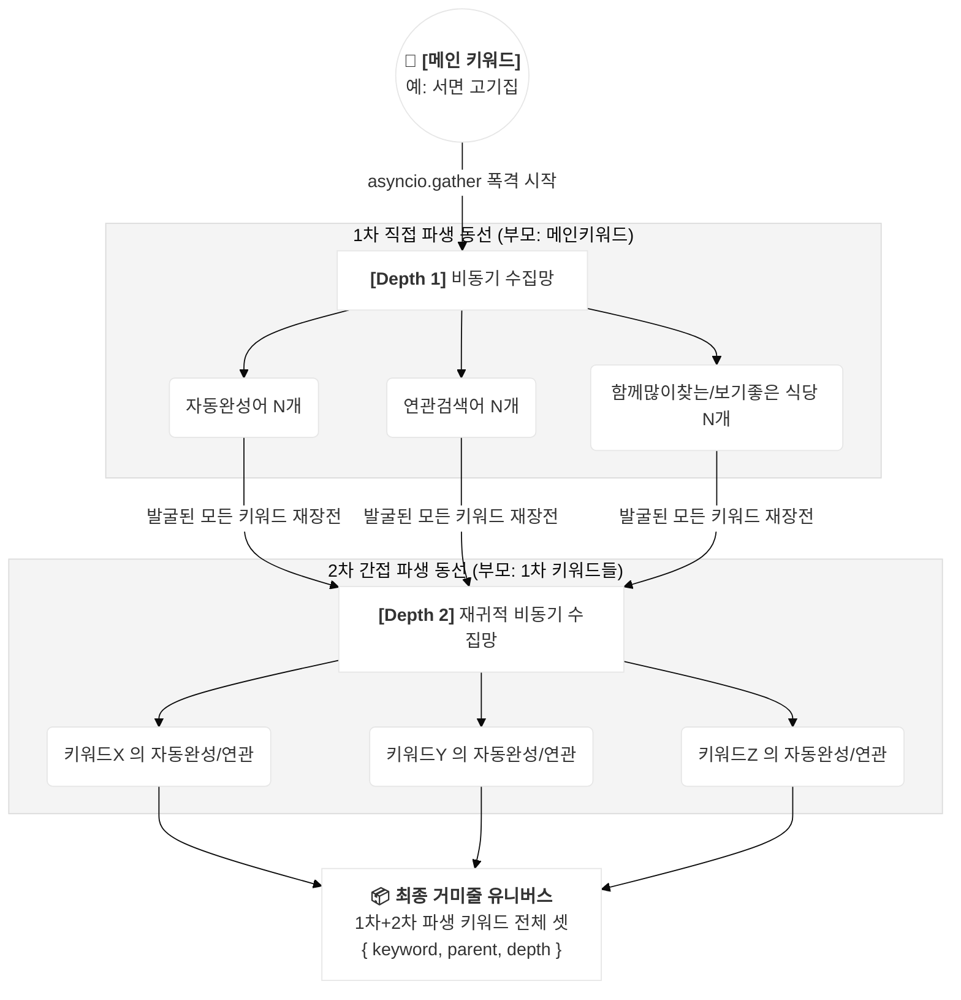

# 고객 여정(Customer Journey) 기반 키워드 발굴 아키텍처

본 문서는 사용자가 네이버 통합 검색창에 메인 키워드를 입력한 순간부터, 다른 파생 키워드를 클릭하며 다른 가게로 이탈하거나 특정 목적지로 좁혀 들어가는 **'고객 클릭 여정의 거미줄(Universe)'** 을 역추적하여 수집하는 고도화된 스크래핑 아키텍처를 설명합니다.

*(해당 엔진 코드: `scripts/06_최종_전체상점_병렬추출기/keyword_discovery_engine.py`)*

---

## 1. 레거시(구버전) vs 신버전 구조적 차이

### ❌ 레거시(동기식): 선형적 꼬리물기
과거 방식은 단순히 엑셀의 빈칸을 채우기 위해 A ➜ B ➜ C 형태의 좁고 얕은 검색을 수행했습니다.
* **흐름:** [메인 키워드] ➜ (그것의) [자동완성 1개] ➜ (그것의) [연관검색 1개]
* **단점:** 속도가 느리고, 실제 유저가 중간에 스마트폰 화면의 추천 장소를 터치하여 다른 키워드로 이탈하는 현실적인 '동선'을 전혀 담아내지 못했습니다.

### 🚀 신버전(비동기 병렬): 폭발적 유니버스 확장
신버전 아키텍처는 하나의 [메인 키워드]를 호수에 던진 돌멩이로 간주하고, 거기서 퍼져나가는 **모든 파생되는 파문(클릭 가능한 모든 버튼과 검색어)** 을 `Tree` 구조로 병렬 수집해 거대한 사전을 엮어냅니다.

---

## 2. 데이터 발굴의 4대 원천 (The 4 Pillars)
신버전 엔진은 유저가 스마트폰에서 '보거나 누를 수 있는' 모든 텍스트를 4가지 경로에서 비동기(동시)로 긁어옵니다.

1. **자동완성 API (Autocomplete):** 입력 창에서 텍스트를 칠 때 즉시 떨어지는 네이버 내부 비공식 API 호출 데이터.
2. **연관검색어 (Related):** 모바일 네이버 바닥 쪽에 있는 파란색 버튼 배지들. (강력한 정규식 파싱)
3. **"함께 많이 찾는" (UI 탭):** 플레이스 UI 내부에 노출되어 다른 경쟁 식당으로 트래픽을 빼앗아 가는 추천 장소명 추출.
4. **"함께 보면 좋은" (UI 탭):** 식당 주변의 카페, 관광지 등 사용자의 2차 방문 목적지 추출.

---

## 3. 심도(Depth) 기반 무한 재귀 파싱 구조 (Mermaid)

시스템은 아래의 다이어그램처럼 수집된 키워드를 즉시 다음 스레드의 입력값으로 재장전(Reload)하여 연쇄 폭격을 가합니다.

---

## 4. 비즈니스 도입 로직 (도입 가치)

이 '고객 여정 아키텍처'가 생성해 내는 `{ keyword, parent, depth }` 데이터 셋은 D-PLOG 서비스의 핵심 경쟁력이 됩니다.

### "내 매장 키워드를 뺏어가고 있는 진짜 블랙홀은 어디인가?"
* 단순히 '서면 고기집' 1등을 모니터링하는 시대는 끝났습니다.
* 고객이 '서면asd 고기집'을 쳤지만, 네이버 모바일 UI가 하단에 **[관련 추천: 서면 구워주는 고기집]** 을 띄워서 트래픽이 그쪽으로 빨려 들어간다면?
* 본 아키텍처는 **고객이 검색어 A에서 검색어 B로 징검다리를 건너간 흔적(Parent-Child 관계)**을 남기기 때문에, `"가맹점주님, 지금 '서면 고기집'에 돈 쓸 때가 아니라 '서면 구워주는' 키워드부터 막으셔야 합니다."` 라는 AI 진단 리포트를 생성하기 위한 압도적인 논리적 근거(Data Fact)가 됩니다.

---

## 5. 키워드 확장 체인 예제 (Example Universe)

실제로 **"부산 해운대 맛집"** 이라는 단일 메인 키워드를 엔진에 던졌을 때 알고리즘 내부에서 어떻게 유니버스가 확장되는지 직관적으로 보여주는 예시입니다.

### 🎯 [기준점] 메인 키워드
* `부산 해운대 맛집`

### 🌿 [Depth 1] 1차 직접 파생 (부모: 부산 해운대 맛집)
네이버 검색창 및 모바일 통합검색 결과 화면에서 1차적으로 비동기 추출된 데이터입니다.
* **자동완성 API 발굴:** `부산 해운대 맛집 더쿠`, `부산 해운대 맛집 내돈내산`, `해운대 맛집 순위`
* **모바일 연관검색어 발굴:** `해운대 가성비 맛집`, `해운대 웨이팅 맛집`, `광안리 맛집`
* **'함께 많이 찾는' 탭 발굴:** `해운대 해성막창`, `해운대 암소갈비` (경쟁사 식당명 탈취)
* **'함께 보면 좋은' 탭 발굴:** `해운대 블루라인파크`, `동백섬` (관광지/카페 등 2차 방문 목적지)

### 🌿 [Depth 2] 2차 간접 파생 (부모: Depth 1에서 발굴된 키워드들)
1차 파생에서 확보한 수십 개의 단어 각각에 대해 엔진이 재귀적으로 다시 비동기 병렬 검색을 쏟아붓습니다.
* **부모 키워드 [`해운대 가성비 맛집`] 파생 조사:**
  * ➜ (자동/연관) `해운대 가성비 횟집`, `해운대 혼밥 가성비 식당`
* **부모 키워드 [`부산 해운대 맛집 내돈내산`] 파생 조사:**
  * ➜ (자동/연관) `해운대 찐맛집 내돈내산`, `해운대 오션뷰 맛집 내돈내산`
* **부모 키워드 [`해운대 해성막창`] 파생 조사:**
  * ➜ (자동/연관) `해운대 막창 골목`, `부산 해운대 양대창`

> 💡 **최종 결과:** 대표님이 단 1개의 키워드로 출발 명령을 내렸지만, 스크립트가 10초~15초 만에 작동을 끝내면 수백 개의 **연관성 100% 진성 타겟 키워드 뭉치(Universe Set)** 가 완성되어 돌아옵니다!
