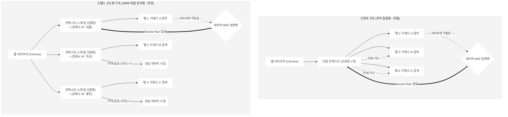

# 스텔스 병렬 수집 V2: 완벽한 독립 세션 격리 아키텍처 (A to Z 가이드)

본 문서는 네이버 플레이스 데이터를 수집할 때 발생하는 차단을 우회하기 위해 도입된 **V2 아키텍처(독립 세션 격리 및 프록시 분산)**의 개념과 용어를 누구나 이해하기 쉽게 정리한 문서입니다.

---

## 📖 핵심 용어 사전 (알기 쉬운 비유)

이 아키텍처를 이해하기 위해서는 브라우저의 3단계 구조와 차단 용어를 알아야 합니다.

| 기술 용어 | 쉬운 비유 | 설명 |
| :--- | :--- | :--- |
| **Browser (브라우저)** | **크롬 브라우저 프로그램 그 자체** | 바탕화면에 있는 크롬 아이콘을 더블클릭해서 켜는 '껍데기(프로그램)'입니다. |
| **Context (컨텍스트)** | **유저 프로필 (신분증/쿠키)** | 크롬 우측 상단의 '로그인된 사용자 계정' 또는 '시크릿 창' 1개 단위입니다. 컨텍스트가 같으면 동일한 사람으로 취급됩니다. |
| **Page (페이지/탭)** | **웹 브라우저의 탭(Tab)** | 한 명의 사람(컨텍스트)이 띄워놓은 여러 개의 창(네이버, 유튜브, 카카오 등)입니다. |
| **Proxy (프록시 IP)** | **대포폰 / 우회 기지국** | 내가 서울에서 접속해도 뉴욕이나 부산에서 접속한 것처럼 IP 주소(출발지)를 속여주는 중간 다리 역할을 합니다. |
| **Session Ban (쿠키 연대 책임)** | **가족 동반 추방** | 네이버가 특정 탭 1개에서 불법 매크로를 감지했을 때, 그 탭과 **같은 컨텍스트(신분)를 공유하는 모든 탭을 동시에 차단**하는 강력한 징계입니다. |
| **IP Ban (단일 IP 폭주 차단)** | **건물 출입 금지** | 50개의 서로 다른 신분증(컨텍스트)을 들고 오더라도, **같은 아파트(동일 IP)**에서 0.1초 만에 50명이 무더기로 뛰쳐나오면 "이건 DDoS 공격이다!"하고 아파트 전체의 통신을 막아버리는 네트워크 차단입니다. |

---

## 🏗️ 아키텍처 변화: V1 vs V2 (머메이드 다이어그램)

과거 V1 방식이 왜 위험했는지, 그리고 V2가 어떻게 이를 해결했는지 시각적으로 비교해 봅니다.

---

## 🎯 A to Z 아주 쉬운 설명 (비유)

### 과거의 나 (V1 아키텍처)
대표님이 8명의 직원(스레드)을 데리고 네이버 플레이스라는 백화점에 시장 조사를 갔습니다. 
그런데 8명이 전부 **"똑같은 노마드랩 주식회사 유니폼(단일 컨텍스트)"**을 입고 백화점에 우르르 들어갔습니다. 
직원 1번이 너무 빨리 사진을 찍다가 백화점 보안관(네이버 캡차)에게 걸렸습니다. 
보안관은 유니폼 마크를 보고 **"저 유니폼 입은 8명 전부 다 당장 쫓아내!" (Session Ban)** 라고 소리쳤고, 나머지 7명도 억울하게 쫓겨났습니다.

### 달라진 나 (V2 아키텍처)
이제 대표님은 8명의 직원에게 각기 다른 **사복(Context 분리)**을 입혔습니다.
한 명은 정장, 한 명은 츄리닝, 한 명은 학생복을 입혔죠. 
이제 직원 1번이 너무 빨리 지나가다 보안관에게 걸려 쫓겨나더라도, 나머지 7명은 서로 남남인 척(독립된 쿠키) 연기할 수 있으므로 안전하게 끝까지 시장 조사를 마칠 수 있게 되었습니다! 

### 스케일업(무한 확장)을 위한 최후의 한 조각 (Proxy IP)
옷(Context)을 갈아입혀서 보안관의 눈은 속였지만, **백화점 출입구(IP 주소)** 하나에서 100명이 1초 만에 우르르 뛰어 들어오면 보안관은 옷차림과 상관없이 문 자체를 걸어 잠급니다 **(IP Ban)**.

이 문제를 해결하기 위해 도입하는 기술이 바로 **"글로벌 프록시(Proxy)"** 입니다. 
V2 코드는 이미 각자 서로 다른 옷(Context)을 입도록 아키텍처가 짜여 있으므로, 옷을 입을 때 **"너는 동문으로 들어가, 너는 서문으로 들어가, 너는 남문으로 들어가" (각기 다른 가정용 IP 부여)** 라는 명령 한 줄만 추가하면, 100명이건 1000명이건 서로 완전한 남남처럼 네이버 서버를 동시에 타격할 수 있습니다!
