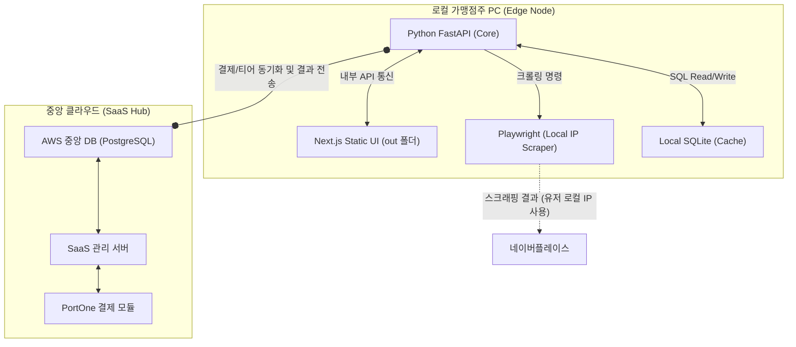

# D-PLOG: Edge-SaaS 통합 아키텍처 (DDD 기반)

## 1. 개요 (Abstract)
본 아키텍처는 Next.js의 정적 파일 빌드물(`out`)을 Python FastAPI가 서빙하여 하나의 프로세스로 동작하게 하는 **단일 패키징(Single Packaging)** 구조를 정의합니다. 향후 **유저 기기의 로컬 IP를 스크래핑에 활용하는 분산 엣지 노드(Edge Node)** 역할과 플랫폼 중앙부스터로 진화할 **SaaS (PortOne 빌링/권한 등)**를 모순 없이 결합하기 위해 **Domain-Driven Design (도메인 주도 설계)**를 채택합니다.

## 2. 런타임 아키텍처 (Runtime Architecture)



- **장점**: 막대한 프록시/서버실 구축 비용 없이, 실제 유저 PC를 스크래핑 노드로 통제합니다.
- **배포 방식**: 파이썬 데스크톱 런타임 (.exe) 스텔스 구동 혹은 Chrome Extension 기반 구동.

---

## 3. 로컬/SaaS 모드 분할 아키텍처 (Feature Toggle)

본 프로젝트는 초기에 "Local(단일 사용자)" 환경으로 배포되며, 향후 "SaaS(다중 사용자)" 환경으로 매끄럽게 전환하기 위해 **Feature Toggle 패턴**을 사용합니다. 프론트엔드(Next.js)와 백엔드는 `.env` 환경 변수(`NEXT_PUBLIC_APP_MODE=local` 또는 `saas`)에 따라 다음과 같이 다르게 동작합니다.

### 3-1. Local (Community) Edition 동작 규약
- **목적**: 불필요한 마케팅 장벽 및 로그인 마찰 제거 (Single Tenant).
- **프론트엔드 라우팅**: 사용자가 루트(`/`) 경로에 접근 시, Next.js 미들웨어 혹은 루트에서 `(home)` 마케팅 페이지를 스킵하고 곧바로 `/dashboard` 나 `(onboarding)` 매장 등록 화면으로 강제 리다이렉트 처리합니다.
- **세션 관리**: 사용자 인증 없이 전역 상태 관리에 가상의 `Local Owner (id: 1)` 세션을 주입하여 백엔드 DB 연동의 오작동을 막는 "Mock Auth" 기법을 운용합니다. 

### 3-2. SaaS (Enterprise) Edition 전환 시 동작 규약
- **목적**: 클라우드 기반 완전 유료화/보안 적용 (Multi Tenant).
- **프론트엔드 라우팅**: 환경 변수를 `saas`로 변경하면, B2B 마케팅 랜딩 페이지(`(home)`)가 오픈되며 사용자에게 로그인 화면(`(auth)`)을 제공합니다.
- **세션 관리**: JWT 및 OAuth 2.0 기반 인증 시스템이 가동되며, `User` 데이터베이스와 각 `Store` 자원 소유권 매핑이 강제화됩니다.

---

## 4. 파이썬 백엔드 디렉터리 설계 (DDD 기반)

기능이 뒤섞여 스파게티 시스템이 되는 것을 방지하기 위해 역할을 비즈니스 단위로 분리합니다.

```text
backend_python/
├── main.py                 # FastAPI 인스턴스, 정적(Static) 마운팅, Exception 핸들러
│                           # 핵심 도메인 (비즈니스 중심)
├── domains/
│   ├── stores/             # 비즈니스: 사용자 상가 등록, 대시보드 지표 통계 처리
│   │   ├── router.py       # (HTTP Request 핸들러)
│   │   ├── schema.py       # (Pydantic 모델)
│   │   ├── service.py      # (비즈니스 로직)
│   │   └── repository.py   # (DB 연산 전담)
│   ├── scraping/           # 비즈니스: 네이버 스크래핑 엔진 (WAF 우회 및 파싱)
│   ├── users/              # 비즈니스: 사용자 인증, JWT 쿠키 발급, Tier(유/무료 등급) 제어
│   └── billing/            # 비즈니스: PortOne 정기 결제/플랜 구독 로직 연동
│
├── core/                   # 런타임/공통 인프라
│   ├── database.py         # SQLAlchemy 연동 (초기 SQLite, 추후 PostgreSQL 대응)
│   ├── config.py           # BaseSettings, 환경 변수
│   └── security.py         # 패스워드 해싱, 의존성 주입(Depends) 권한 보호 로직
└── static_out/             # Next.js 프론트엔드가 'npm run build' 로 떨군 최종 결과물
```

---

## 5. 구현 에픽 및 개발 로드맵 (Phases to Epics)

요청하신 **"우선 MVP 구동부터 집중하고, 보안이나 유료화는 나중에 구현하는 전략"**에 맞추어 에픽을 분리했습니다.

### Epic 1: View-Core 단일 구동 환경 구축 (Phase 1)
- **목표**: 프론트/백엔드 이중 서버의 의존성을 끊어내고 1개의 파일로 구동.
- **작업**:
  - `next.config.ts` 의 API 프록시 정책 제거 및 `output: 'export'` 설정.
  - Python FastAPI 기초 라우터(`serve_nextjs_ui`)를 구축하여 로컬 빌드물 서빙.
  - SPA의 빈번한 404 Refresh 에러를 방지하기 위한 Fallback 라우터 로직 달성.

### Epic 2: 도메인 기반 스크래퍼 통합 (Phase 2 & 3)
- **목표**: 유저 스토어 등록과 스크래핑을 DDD 모듈로 통폐합.
- **작업**:
  - `domains/stores` 와 `domains/scraping` 모듈 스캐폴딩 생성.
  - `preview_server.py` 의 파싱 로직을 `scraping` 모듈로 이관.
  - SQLite를 `database.py`에 세팅하여 결과 데이터를 DB에 영구 영속화. (제어 지연시간 Zero 화)

### Epic 3: 분산 엣지 노드망 구성 및 중앙화 (Beta Release)
- **목표**: 오프라인 1대의 PC가 아니라 전국 유저망 연결 시작.
- **작업**:
  - `.exe` 브라우저 팝업/Extension 추출 방식으로 가맹점주 배포 빌드.
  - `sync_service` 백그라운드 큐를 구축해 중앙 Cloud Postgres DB 와 동기화 시작.

### Epic 4: 유료화 체계 적용 및 보안 고도화 (SaaS)
- **목표**: 비즈니스 모델(과금) 및 악성 사용 억제 적용.
- **작업**:
  - `domains/billing`, `domains/users` 인프라 해제.
  - PortOne 구독형 토큰 결제 도입. JWT 액세스 토큰과 회원 티어(`FREE`, `PREMIUM`) 분리 적용.
  - `security.py` 를 통해 인증 없는 무단 API 콜과 스크래퍼 호출 차단 (API Rate Limiting 적용).
  - SaaS 트래픽 비용 최적화를 위한 **[하이브리드 프록시 티어링 라우터]** 도입 (상세 내용은 `saas_proxy_tiering.md` 참조).
