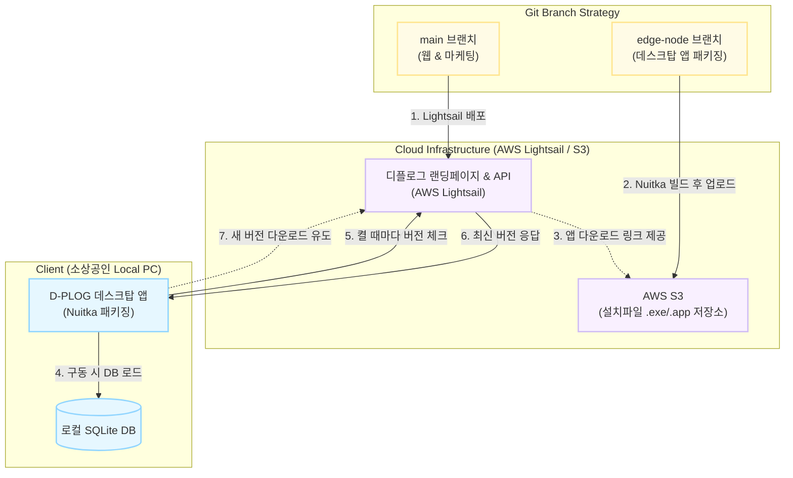

# 패키징 전략(Packaging_Strategy)

이 문서는 D-PLOG 엣지 노드(Edge Node)의 로컬 패키징 및 배포를 위한 Phase 1 공식 아키텍처 전략입니다.

## 1. 아키텍처 개요
- **프론트엔드:** Next.js (Static Export, `out/`)
- **백엔드:** Python FastAPI (정적 파일 서빙 및 로컬 스크래핑 제어)
- **실행 환경:** 사용자 OS (Windows `.exe` / macOS `.app`) 기반 단일 실행 파일

## 2. 보안(Security) 및 난독화
Claude 및 LLM, 디컴파일러를 통한 역공학(Reverse Engineering)을 원천 차단하기 위해 다음 기술을 적용합니다.
- **Nuitka 컴파일러:** 순수 Python 코드(`.py`)를 유지하거나 단순 압축(PyInstaller)하는 대신, C/C++ 코드로 변환 후 기계어 바이너리로 완전 컴파일합니다.
- **안티 디버깅(Anti-Debugging):** 런타임 시 디버거 부착 여부를 감지하여 즉각 프로세스를 종료시킵니다.
- **프론트엔드 난독화:** Next.js 빌드 시 Webpack/Terser를 통한 강도 높은 코드 꼬임(Obfuscation) 처리 및 소스 맵(Source Map) 제거.

## 3. 데이터 영속성 (Data Persistence)
앱 재설치나 버그 픽스 업데이트 시 사용자 데이터가 소실되지 않도록, 로컬 SQLite DB의 저장 위치를 프로젝트 디렉토리 내부가 아닌 OS 표준 사용자 공간으로 강제 분리합니다.
- **Windows:** `%APPDATA%\dplog\db\dplog.sqlite`
- **macOS:** `~/Library/Application Support/dplog/db/dplog.sqlite`

## 4. 로컬 자원 최적화 (브라우저 및 OS)
- **최소 요구 사양:** **Windows 10 이상** 및 최신 macOS 환경 타겟. (구형 POS기 지원 배제)
- 브라우저 엔진(Playwright/Selenium 등)의 바이너리를 패키징에 포함하지 않고, 사용자 PC에 설치된 **Chrome/Edge 브라우저**를 `--app` 옵션(주소창 없는 앱 모드)으로 호출하여 용량 다이어트 달성.

## 5. 투트랙 배포 및 업데이트 파이프라인 (Architecture)
디플로그는 랜딩페이지용 `main` 브랜치와 데스크탑 패키징용 `edge-node` 브랜치로 분리되어 운영되며, 초기 인프라는 가성비와 상업적 안정성을 고려하여 **AWS Lightsail**을 기반으로 구축됩니다.

### 작동 시나리오 (Phase 1)
1. **마케팅/배포:** 사용자는 `main` 브랜치 코드로 **AWS Lightsail**에 배포된 랜딩페이지에 접속합니다.
2. **다운로드:** 랜딩페이지의 다운로드 버튼을 누르면, AWS S3에 미리 올려둔 Nuitka 빌드 파일(`.exe` / `.app`)이 다운로드됩니다.
3. **업데이트 체크 (Polling):** 사용자가 바탕화면의 앱을 켤 때마다, 로컬의 앱이 **Lightsail 서버의 API(`GET /api/version`)**를 찔러 최신 버전을 묻습니다.
4. **소프트 업데이트:** 앱 버전이 낮다면, 화면에 **"새로운 기능이 추가되었습니다! 홈페이지에서 다시 다운로드 해주세요."** 라는 안내창을 띄워 자연스럽게 랜딩페이지로 재진입시킵니다.

## 6. 테스트 범위
- **화이트박스(White-box):** 인터넷 단절 시 로컬 DB 캐시를 활용한 렌더링 무결성, 스크래퍼 API의 내부 예외 처리 로직 통과 여부.
- **블랙박스(Black-box):** 포트 충돌(8000번 등) 발생 시 동적 포트 할당 여부, 비정상 프로세스 종료 후 재실행 시 무결성 검증.

> **[향후 고려 사항: 계정 세션 보안]**
> MVP 단계(Phase 1)에서는 네이버 아이디/비밀번호 연동을 받지 않아 보안 리스크가 낮으나, 추후 로그인 세션 기반 크롤링 도입 시 로컬 `dplog.sqlite`에 보관될 세션 쿠키나 토큰에 대해 AES-256 및 하드웨어 시리얼 기반의 **강력한 암호화(Encryption) 레이어**를 반드시 추가해야 함.
