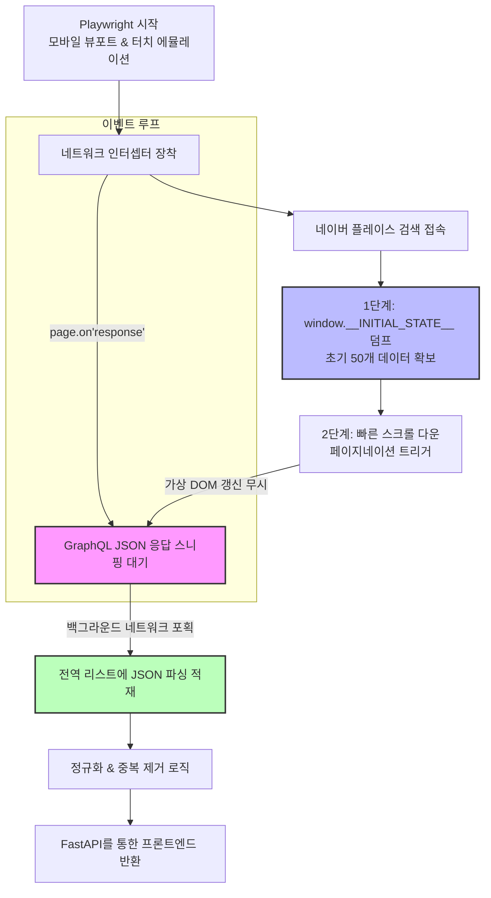

# D-PLOG 랭킹 엔진 아키텍처: Network(GraphQL) Sniffing & Initial State

기존의 D-PLOG 백엔드 엔진은 Playwright를 띄워 모바일 웹의 HTML DOM(`li.VLTHu`, `img`, `a[href]`)을 직접 파싱하는 방식을 사용했습니다. 그러나 네이버 플레이스의 디자인 변경, 클래스명 정기적 난독화, 그리고 가상 DOM(Virtual DOM)의 지연 렌더링(Lazy-loading)으로 인해 지속적인 누락 버그(예: 광고 링크 추적 실패, 이미지 URL 누락)가 발생했습니다.

이를 극복하기 위해 네이버가 내부 통신에 사용하는 순수 JSON 원본 데이터를 낚아채는 **하이브리드 네트워크 스니핑 아키텍처**로 전면 전환하였습니다.

## 1. 아키텍처 핵심 구조

스크래퍼는 Playwright 브라우저를 백그라운드에 구동하지만, 더 이상 화면 구조(HTML DOM)를 신뢰하지 않습니다. 대신 **브라우저의 네트워크 단을 감청(Intercept)**하여 백엔드 데이터베이스로 활용합니다.

## 2. 작동 메커니즘 상세

### 단계 1: 초고속 자바스크립트 변수 덤프 (Initial State)
웹페이지가 처음 접속되면 네이버 서버는 초기 검색결과 50개를 HTML 내부에 자바스크립트 객체(`window.__INITIAL_STATE__`) 형태로 박제하여 내려줍니다. 엔진은 HTML이 파싱되자마자 이 전역 변수를 `page.evaluate()`로 훔쳐내어 즉시 배열에 편입시킵니다. 렌더링을 기다릴 필요조차 없습니다.

### 단계 2: GraphQL 네트워크 패킷 인터셉트 (GraphQL Sniffing)
사용자가 스크롤을 내리면, 브라우저는 추가 리스트를 불러오기 위해 `api.place.naver.com/graphql`로 비동기 요청을 쏩니다.
엔진 본체는 브라우저 스크롤을 무지막지하게 내려버리며 DOM 렌더링 실패는 가볍게 무시합니다. 그 사이 뒤에서는 `page.on("response")` 이벤트 훅이 발동하여 네이버 웹 서버가 브라우저에게 돌려준 GraphQL 퓨어 JSON 데이터만을 중간에서 채어옵니다.

## 3. 이점 및 해결된 이슈

- **이미지 URL 누락 완전 해결**: 기존엔 스크롤이 빠르면 리액트 엔진이 `` 태그를 그리기 전에 파서가 지나쳐 이미지가 누락되었으나, 지금은 서버에서 넘어오는 JSON의 `imageUrl` 속성을 그대로 뽑으므로 렌더링 속도와 무관하게 100% 추출.
- **광고(AD) 트래킹 URL 완벽 우회**: 네이버 파워링크/광고 상점들은 종종 고유 식별자(`id`) 링크 대신 `/searchad/` 계열의 추적 링크를 씌워 실제 경로 복원이 어려웠으나, JSON 데이터에 들어있는 원본 `id`와 부가 링크(`link`)를 조합하여 버그 파티를 원천 차단.
- **네이버의 유지보수에 강건함**: 네이버 웹 개발팀이 내일 당장 CSS 클래스명과 레이아웃을 100번 바꾸더라도 본 스크래퍼는 서버간 통신 규약(JSON 구조)이 바뀌지 않는 한 절대 고장나지 않음.

## 4. 참고 사항 (네이버 자체 데이터 제한)
단, 광범위 검색어(예: 부산 꽃집)의 경우 네이버 모바일 플레이스 자체가 트래픽 오과부하 방지를 위해 전체 결과를 약 100~300건으로 잘라서 응답합니다. (이 이상의 결과를 획득하려면 위치 필터 결합, 혹은 검색어 세분화가 필수적입니다.)
