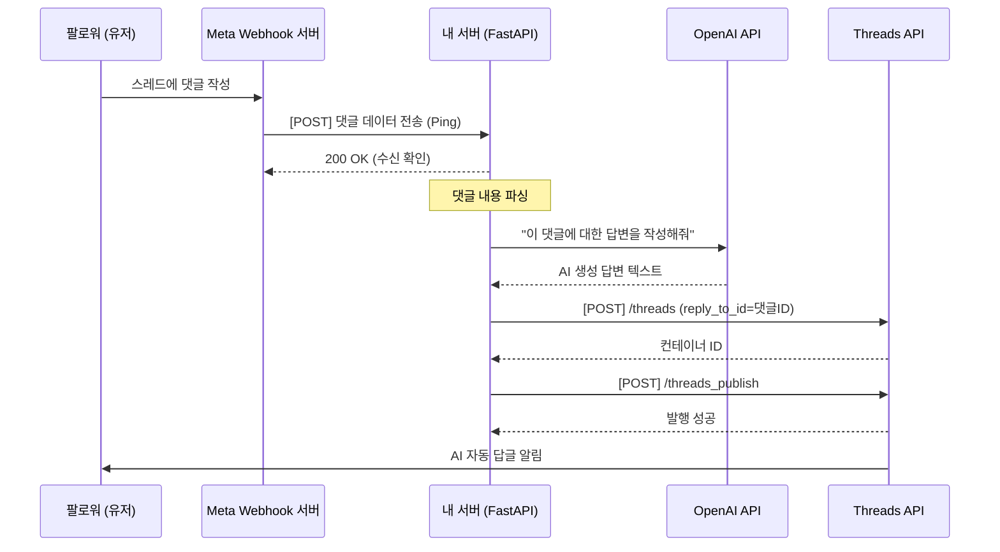

# 🤖 Threads AI 자동 답글 봇 (Auto-Responder) 구축 가이드

이 문서는 Threads에 달린 댓글을 실시간으로 감지하고, AI(LLM)를 활용해 자동으로 대댓글을 달아주는 오토봇 파이프라인의 설계 및 구현 가이드입니다.

---

## 🏗️ 아키텍처 오버뷰



---

## 🛠️ 사전 준비물 (Prerequisites)

1. **상시 구동 서버**: Webhook을 수신할 수 있는 24시간 서버 (FastAPI 추천).
   - *로컬 테스트 시*: `ngrok`을 사용하여 로컬 포트를 외부 HTTPS URL로 노출.
   - *프로덕션 배포 시*: Vercel, Render, AWS EC2 등.
2. **OpenAI API Key**: 답변 텍스트 생성을 위한 LLM API (`.env` 에 저장)
3. **Meta Webhook 설정**: Meta 개발자 대시보드에서 Webhook `replies` 토픽 구독.

---

## 💻 단계별 구현 플랜

### Step 1. FastAPI Webhook 서버 구축
Meta 서버가 보내는 Ping을 받을 엔드포인트를 만듭니다. Meta는 최초 연결 시 `GET` 요청으로 인증(Verify)을 하고, 이후 댓글이 달릴 때마다 `POST` 요청을 보냅니다.

```python
# main.py (FastAPI 예시)
from fastapi import FastAPI, Request, Response

app = FastAPI()
VERIFY_TOKEN = "my_secret_verify_token_123"

# 1. Meta Webhook 인증 엔드포인트
@app.get("/webhook")
async def verify_webhook(request: Request):
    mode = request.query_params.get("hub.mode")
    token = request.query_params.get("hub.verify_token")
    challenge = request.query_params.get("hub.challenge")

    if mode == "subscribe" and token == VERIFY_TOKEN:
        return Response(content=challenge, media_type="text/plain")
    return Response(status_code=403)

# 2. 댓글 이벤트 수신 엔드포인트
@app.post("/webhook")
async def receive_webhook(request: Request):
    data = await request.json()
    
    # 백그라운드 태스크로 AI 처리 및 답글 로직 넘기기
    # (Meta에는 즉시 200 OK를 리턴해야 함)
    process_reply_async(data)
    
    return {"status": "success"}
```

### Step 2. Meta 개발자 콘솔 Webhook 연결
1. [Meta App Dashboard] -> [Threads API] -> [설정] -> [Webhook] 섹션으로 이동
2. **콜백 URL**: `https://내서버주소/webhook` (ngrok 도메인 등)
3. **확인 토큰 (Verify Token)**: 코드에 작성한 `my_secret_verify_token_123`
4. 구독할 토픽: `replies` 체크

### Step 3. AI 답변 생성 (LLM 연동)
수신한 댓글 텍스트를 OpenAI에 보내어 맥락에 맞는 답변을 생성합니다.

```python
import openai

def generate_ai_reply(original_post_text, comment_text):
    prompt = f"""
    당신은 인기 있는 맛집 리뷰어입니다. 
    당신의 본문: "{original_post_text}"
    달린 댓글: "{comment_text}"
    이 댓글에 대해 친절하고 위트 있는 1~2문장의 답글을 달아주세요. 해시태그는 쓰지 마세요.
    """
    response = openai.chat.completions.create(
        model="gpt-4o-mini",
        messages=[{"role": "user", "content": prompt}]
    )
    return response.choices[0].message.content.strip()
```

### Step 4. Threads에 대댓글 발행
기존 `open_threads.py` 에 있는 발행 로직을 그대로 사용하되, `reply_to_id`에 **수신받은 댓글의 미디어 ID**를 넣습니다.

```python
# data에서 댓글 ID 추출 후 발행
comment_id = data['entry'][0]['changes'][0]['value']['id']
ai_response_text = generate_ai_reply(본문, 댓글)

# 기존에 만들어둔 함수 재활용
create_text_container(user_id, token, ai_response_text, reply_to_id=comment_id)
```

---

## ⚠️ 주의사항 및 팁

1. **200 OK 즉시 반환**: Meta 웹훅은 20초 내에 응답을 못 받으면 실패로 간주하고 계속 재시도합니다. AI 답변 생성(LLM)은 시간이 걸리므로 반드시 **백그라운드 스레드(Background Tasks)**로 분리해서 처리하고 메인 요청은 즉시 `200 OK`를 리턴해야 합니다.
2. **무한 루프 방지**: 봇이 봇 자신에게 답글을 달지 않도록, 알림을 보낸 사람이 `자신의 계정 ID`인지 체크하는 로직을 반드시 넣어야 합니다.
3. **앱 리뷰(App Review)**: 본인 계정이 아닌 일반 대중의 댓글에도 모두 반응하려면 앱을 `Live Mode`로 전환해야 할 수 있습니다 (테스트 기간에는 본인 및 테스터 계정만 작동).
