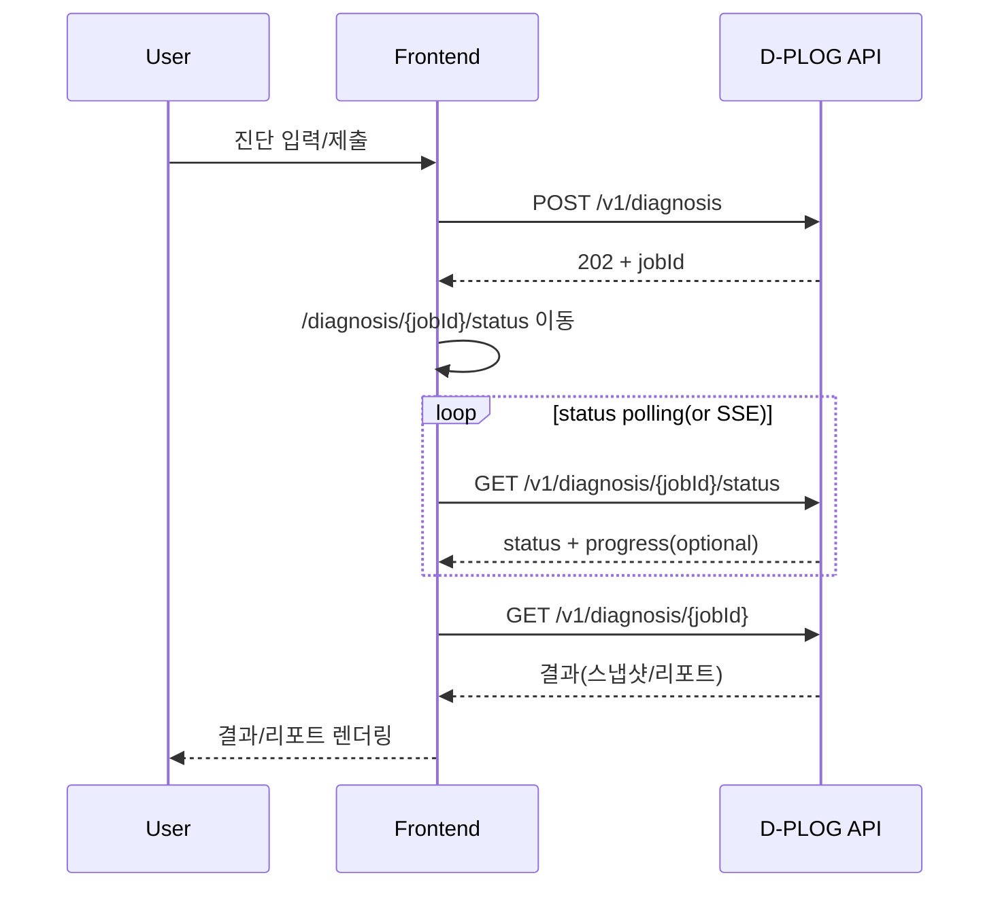

# D-PLOG 프론트엔드 아키텍처 (Next.js 기준 통합본)

## 1. 목적

백엔드의 모듈러 모놀리스(DDD) 구조(`docs/ddd-architecture.md`)와 정합되도록, 프론트엔드를 **기능/도메인 경계 기준으로 확장 가능한 구조**로 설계한다.

- 랜딩(마케팅) / 진단(업무 플로우) / 리포트(결과) / 결제(과금)까지 자연스럽게 확장
- 비동기 잡(`jobId`) 기반 진단 흐름을 FE에서 안정적으로 처리(폴링/SSE, 재시도, 부분 결과)
- 디자인 시스템 토큰을 “코드로 고정”하여 UI 일관성 유지

## 2. 기본 원칙

1. **Feature-first + 경계 준수**
   백엔드 bounded context(예: `store`, `ranking`, `report`)를 FE에서도 “폴더/타입/API” 레벨로 분리한다.

2. **UI에서 직접 `fetch()` 금지**
   API 호출은 `shared/api` + `features/*/api`에서만 수행한다. (에러/타임아웃/인증 공통화)

3. **DTO와 화면 모델 분리**
   API DTO는 “전송용 타입”, 화면에서 쓰는 도메인 모델은 “표현/규칙 포함 타입”으로 분리하고 mapper로 변환한다.

4. **서버 상태 vs 클라이언트 상태 분리**
   서버 상태(조회/캐시/재시도)는 React Query.  
   작성 중 Draft(위저드 입력)는 Context/Zustand + `sessionStorage` persist.

5. **민감정보는 클라이언트에 두지 않음**
   내순이 API Key/크롤링 토큰/Bedrock 자격증명은 서버에서만 처리. FE는 “진단 요청/상태 조회/결과 조회”만 한다.

6. **Next.js App Router 기준 컴포넌트 분리**

- 데이터 캐시/상태가 필요한 UI는 Client Component로 분리
- 레이아웃/메타데이터/정적 랜딩은 Server Component 중심으로 구성

## 3. 기술 스택(Next.js 권장)

- 프레임워크: Next.js(App Router) + React + TypeScript
- 라우팅/레이아웃: App Router(`app/`), `layout.tsx`/`loading.tsx`
- 서버 상태/폴링: **TanStack Query (React Query)**
- 폼/검증(권장): `react-hook-form` + `zod`
- 스타일: Tailwind CSS
- 에러 트래킹(운영): Sentry(브라우저)

> SEO가 중요한 랜딩은 Next.js의 SSG/ISR로 처리하고, 앱 영역(진단/리포트)은 Client Component + React Query로 운영한다.

## 4. 라우팅(IA) 권장안

- `/` : 랜딩(서비스 소개, CTA)
- `/diagnosis/new` : 진단 시작(위저드 진입)
- `/diagnosis/new/store` : 가게 정보 수집(URL/수기/기등록)
- `/diagnosis/new/keywords` : 대표/희망 키워드 입력
- `/diagnosis/new/confirm` : 요청 요약/제출
- `/diagnosis/[jobId]/status` : 진행 상태(폴링 또는 SSE)
- `/diagnosis/[jobId]` : 결과 요약(스냅샷/요약) + 리포트로 이동
- `/reports/[reportId]` : 리포트 상세
- `/stores` (선택) : 내 매장 목록/히스토리
- `/billing` (옵션) : 구독/플랜/결제

위저드 step을 URL로 분리하면:

- 새로고침/뒤로가기/딥링크가 자연스러움
- 단계별 검증/저장/가드 처리(“이전 단계 완료 여부”)가 쉬움

## 5. 레이어/폴더 구조(Next.js + Feature‑Sliced)

> 아래 구조는 `src/` 사용을 전제로 하며, `app/`은 Next.js App Router 기준이다.

```text
src/
  app/
    (marketing)/
      page.tsx
      layout.tsx
    (app)/
      diagnosis/
        new/
          page.tsx
          store/page.tsx
          keywords/page.tsx
          confirm/page.tsx
        [jobId]/
          status/page.tsx
          page.tsx
      reports/
        [reportId]/page.tsx
      dashboard/
        page.tsx               # (new) 대시보드
      stores/page.tsx
      billing/page.tsx         # 옵션
    providers/                 # QueryClientProvider, ErrorBoundary 등
    hooks/                     # route guard, analytics hook 등
    globals.css
  pages/                       # (선택) 레거시/호환용, 신규 사용 지양
  features/
    auth/                      # login/logout/guard
    diagnosis/
      wizard/                  # step 컴포넌트 + draft state
      submit/                  # POST /v1/diagnosis
      status/                  # polling/SSE
    report/
      viewer/                  # 리포트 뷰어(필터, 섹션 토글 등)
      dashboard/
        ui/                    # (Widget Components)
        model/                 # (State/Logic/Data)
          useDashboardViewModel.ts
        index.ts
      stores/page.tsx
      billing/page.tsx         # 옵션
    providers/                 # QueryClientProvider, ErrorBoundary 등
    hooks/                     # (Common) useMediaQuery, useToast 등
    globals.css
  pages/                       # (선택) 레거시/호환용, 신규 사용 지양

    store/
    keywordSet/
    diagnosisJob/
    rankingSnapshot/
    report/
    billing/                   # 옵션
  shared/
    api/                       # http client, error 표준화, sse
    config/                    # env, routes, queryKeys
    ui/                        # Button/Card/Input/Modal/Toast/Skeleton...
    lib/                       # format, date, storage, assert
    styles/                    # tokens.css
```

## 5. 레이어/폴더 구조 (Detailed FSD)

### 5.1 전체 구조 (Directory Tree)

```text
src/
├── app/                  # Next.js App Router (Routing, Layout, Page composition)
│   ├── (marketing)/      # Group: Landing, Marketing pages
│   ├── (app)/            # Group: Main Application (Auth required)
│   │   ├── dashboard/    # Page: Dashboard
│   │   └── ...
│   └── layout.tsx        # Root Layout
├── features/             # (핵심) 비즈니스 기능 단위 (Slice)
│   ├── auth/             # Slice: 인증
│   │   ├── ui/           # UI Components (LoginForm, SignupForm)
│   │   ├── model/        # Business Logic (Hooks, Stores, Schemas)
│   │   ├── api/          # API Calls (authApi.ts)
│   │   └── index.ts      # Public API (Export barrier)
│   ├── dashboard/        # Slice: 대시보드
│   │   ├── ui/           # Dashboard Widgets
│   │   ├── model/        # useDashboardViewModel
│   │   └── index.ts
│   └── home/             # Slice: 홈/랜딩
│       ├── components/   # (legacy style support) or ui/
│       └── index.ts
├── entities/             # (재사용) 비즈니스 개체 단위
│   ├── user/             # Entity: 사용자
│   ├── stats/            # Entity: 통계 (StatCard)
│   └── ...
├── shared/               # (공통) 특정 기능에 종속되지 않는 유틸리티/UI
│   ├── ui/               # Design System Components (Button, Input...)
│   ├── lib/              # Utils (date, number format...)
│   ├── api/              # Axios/Fetch wrapper
│   └── config/           # Env, Constants
└── widgets/              # (선택) 여러 feature를 조합한 거대 컴포넌트 (Header, Footer)
```

### 5.2 폴더별 역할 (Role & Responsibility)

| Layer        | 역할 (Role)                      | 포함 내용 (Contents)                         | 의존성 방향 (Dependency)                           |
| :----------- | :------------------------------- | :------------------------------------------- | :------------------------------------------------- |
| **App**      | **애플리케이션 조립**            | `page.tsx`, `layout.tsx`, Global Providers   | `App -> Widgets -> Features -> Entities -> Shared` |
| **Widgets**  | **페이지 섹션 조립**             | `Header`, `Footer`, `Sidebar` (Feature 결합) | `Widgets -> Features ...`                          |
| **Features** | **사용자 기능 (User scenario)**  | 로그인, 회원가입, 결제, 대시보드 조회        | `Features -> Entities -> Shared`                   |
| **Entities** | **비즈니스 모델 (Domain model)** | User, Product, Order (재사용 가능한 단위)    | `Entities -> Shared`                               |
| **Shared**   | **공통 인프라 (Infrastucture)**  | UI Kit, Utils, API Client                    | **No Dependency** (최하위)                         |

### 5.3 Slice 내부 구조 (Internal Structure)

각 `features`나 `entities` 폴더(Slice)는 아래 구조를 따릅니다.

- **`ui/`**:
  - 해당 기능의 View를 담당하는 React 컴포넌트.
  - 로직은 최소화하고 `props`나 `model`의 훅을 통해 데이터를 받습니다.
- **`model/`**:
  - 비즈니스 로직, 상태 관리, 폼 검증(Schema), 커스텀 훅(`useViewModel`).
  - **규칙**: UI와 로직을 분리하여 테스트 용이성 및 가독성 확보.
- **`api/`**:
  - 서버 통신 코드. `shared/api`를 사용하여 요청.
  - DTO 타입 정의 포함 가능.
- **`index.ts`**:
  - **Public API**. 외부에서 이 Slice를 사용할 때 접근 가능한 요소만 `export`.
  - 캡슐화를 위해 내부 파일 직접 import를 지양하고 `index.ts`를 통해 import 하도록 유도.

### 5.4 의존성 규칙 (Dependency Rule)

- **상위 레이어는 하위 레이어를 import 할 수 있다.** (App -> Features)
- **하위 레이어는 상위 레이어를 import 할 수 없다.** (Features -> App (X), Shared -> Features (X))
- **동일 레이어 간의 import는 지양한다.** (Feature A -> Feature B (X))
  - _예외_: 명확한 부모-자식 관계나, Cross-cutting 관심사의 경우 제한적으로 허용하나, 가급적 **Widgets**이나 **App** 레벨에서 조합하는 것을 권장.

---

## 6. 백엔드 모듈(DDD) ↔ 프론트엔드 매핑

| Backend BC(모듈) | Frontend(주요 위치)                           | 비고                        |
| ---------------- | --------------------------------------------- | --------------------------- |
| `auth`           | `features/auth`, `entities/user`              | 토큰/세션 방식 확정 필요    |
| `store`          | `entities/store`, `features/diagnosis/wizard` | URL 크롤링은 서버에서만     |
| `ranking`        | `entities/rankingSnapshot`                    | 결과 화면/리포트 근거       |
| `report`         | `entities/report`, `features/report/viewer`   | 섹션/근거/액션              |
| `billing`        | `entities/billing`, `app/(app)/billing`       | 옵션                        |
| `ai-rag`         | 직접 호출 X                                   | 리포트/코멘트 결과로만 노출 |
| `batch`          | 직접 연동 X                                   | job 상태만 소비             |
| `integration`    | 직접 연동 X                                   | FE는 D-PLOG API만 호출      |

진단 플로우처럼 여러 컨텍스트가 엮이는 유스케이스는 `features/diagnosis/*`에서 오케스트레이션한다.

## 7. API 레이어 설계(필수)

### 7.1 공통 HTTP 클라이언트

`shared/api/http.ts`에서만 네트워크 정책을 가진다.

- `baseUrl`(`NEXT_PUBLIC_API_BASE_URL`) + `credentials` 정책
- 타임아웃/재시도(네트워크 에러만) / JSON 파싱
- `ApiError` 표준화(HTTP status, code, message, traceId/requestId)

### 7.2 도메인별 API 모듈

- `features/diagnosis/submit/api.ts` : `POST /v1/diagnosis`
- `features/diagnosis/status/api.ts` : `GET /v1/diagnosis/:jobId/status`
- `features/report/viewer/api.ts` : `GET /v1/reports/:reportId`

규칙:

- UI 컴포넌트는 “API 함수”만 호출(엔드포인트 문자열 금지)
- Query Key는 `shared/config/queryKeys.ts`에 중앙화

### 7.3 타입 안정성(권장)

- **OpenAPI 기반 코드 생성**: 백엔드에서 Swagger/OpenAPI 제공 → FE에서 타입/클라이언트 생성
- **런타임 스키마 검증**: `zod`로 “응답 구조”를 검증해 깨진 응답을 조기에 감지

## 8. 네이밍 컨벤션 (Naming Convention)

일관성을 위해 아래 규칙을 강제합니다.

### 8.1 폴더 네이밍

- **`ui`**: 화면에 그려지는 **View** 컴포넌트만 위치합니다.
- **`model`**: 단순히 훅만 있는 것이 아니라, **데이터(Schema/Type)**와 **로직(Hook)**을 모두 포함하는 **Domain Model**의 의미로 `model`을 사용합니다. (`hooks` 폴더로 명명 시 `schema.ts` 위치가 애매해짐)
- **`api`**: 서버 통신 코드가 위치합니다.

### 8.2 파일 네이밍

- **ViewModel (Page Logic)**: `use[Feature]ViewModel.ts`
  - _예_: `useLoginViewModel.ts`, `useDashboardViewModel.ts`
  - 화면 전체의 상태와 이벤트 핸들러를 묶어서 리턴하는 핵심 훅입니다.
- **Data/Schema**: `schemas.ts`, `types.ts`
  - _예_: `loginSchema.ts` (X) -> `schemas.ts` (O) (한 폴더 내 응집)
- **UI Component**: PascalCase
  - _예_: `LoginForm.tsx`, `DashboardWidgets.tsx`

## 9. 인증/인가(프론트 관점)

백엔드 결정에 따라 FE 정책이 달라진다.

### 8.1 JWT + HttpOnly Cookie(권장)

- FE는 토큰을 저장하지 않음
- 모든 API 호출에 `credentials: 'include'`
- 로그아웃은 서버에서 쿠키 만료 처리
- (필요 시) CSRF 토큰 패턴 적용

### 8.2 Authorization Bearer(대안)

- Access Token은 “메모리” 보관(새로고침 시 `refresh`로 복구)
- Refresh Token은 HttpOnly Cookie(또는 서버 세션) 권장
- 401 발생 시 1회 refresh 후 재시도(무한루프 방지)

### 8.3 라우트 가드

- `GET /v1/auth/me`(또는 동등 API)로 초기 사용자 확인
- 로그인 필요 페이지는 `RequireAuth`로 보호

## 9. 비동기 진단(jobId) UX/상태 처리

### 9.1 권장 플로우

1. 위저드 입력 완료 → `POST /v1/diagnosis`
2. `202 Accepted` + `jobId` 수신
3. `/diagnosis/[jobId]/status`로 이동
4. `status: PENDING/RUNNING` 동안 폴링(또는 SSE)
5. `SUCCESS/PARTIAL`이면 결과 조회(`/v1/diagnosis/:jobId`) 후 요약/리포트로 이동
6. `FAILED`면 재시도/문의 UX 제공(에러 코드/traceId 표시)



### 9.2 React Query 폴링 패턴

- `refetchInterval`을 status에 따라 동적으로 조정
  - RUNNING: 2s → 5s backoff
  - SUCCESS/FAILED: stop
- 실패는 네트워크/5xx만 재시도, 4xx는 즉시 사용자 액션 유도

### 9.3 SSE/WebSocket(선택)

백엔드가 SSE를 제공하면 `EventSource` 기반으로 `status` 화면을 스트리밍 업데이트할 수 있다.  
폴링은 “기본”, SSE는 “옵션”으로 설계해도 된다.

## 10. 컴포넌트 분리 규칙(현재 문제 해결 포인트)

### 10.1 위저드(현재 `Pathfinder.tsx`)

- “컨트롤러(상태/전환)”와 “Step UI” 분리
- Step은 순수 UI + 입력/검증만 담당

예:

- `DiagnosisWizard.tsx` (상태/step 이동)
- `steps/StoreStep.tsx`
- `steps/KeywordStep.tsx`
- `steps/ConfirmStep.tsx`

### 10.2 레이아웃 분리

- 랜딩 레이아웃(마케팅)
- 앱 레이아웃(진단/리포트)

## 11. 디자인 시스템(토큰) 적용

소스 오브 트루스: `design-system/d-plog/MASTER.md`

권장:

- `shared/styles/tokens.css`에 CSS 변수로 토큰 고정(색상/간격/그림자/폰트)
- Tailwind를 쓰는 경우, Tailwind theme에 동일 토큰을 반영

운영 체크:

- 키보드 포커스 항상 표시
- `prefers-reduced-motion` 반영
- 최소 대비(4.5:1) 준수
- 아이콘은 SVG(Lucide 등)만 사용(이모지 금지)

## 12. 에러 처리/관측성(운영)

- `app/providers/ErrorBoundary`로 런타임 에러 격리(“하얀 화면” 방지)
- Sentry 도입 시: `release`/`environment`/`userId` 태깅
- 백엔드 `traceId/requestId`를 `ApiError`에 포함 → 사용자 문의/로그 추적 용이

## 13. 테스트/품질(최소 세트)

- 유닛: 키워드 유효성(중복/길이/금칙어), mapper(DTO→도메인)
- 컴포넌트: 위저드 step 전환/disabled 조건
- E2E(Playwright 권장): 랜딩 → 진단 시작 → 입력 → 제출(모킹) → status → 결과

## 14. 단계별 마이그레이션(현재 코드 기준)

1. `Landing`, `Pathfinder`를 `app/(marketing)` / `app/(app)` 관점으로 정리(진입점 확정)
2. 위저드(step) 분리 유지 + “컨트롤러/Step UI” 분리 완성
3. App Router 기반 URL step 전환(딥링크/뒤로가기 자연화)
4. `shared/api` + React Query 도입(job status polling)
5. 리포트 상세/히스토리 페이지 확장
6. 인증/권한 + 결제(필요 시) 확장
