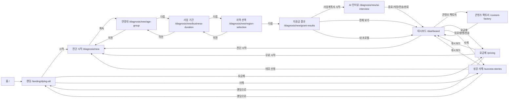

# frontend_next

## Routes
- `/` → `/landing/dplog-alt`
- `/landing/dplog-alt`
- `/pricing`
- `/success-stories`
- `/dashboard`
- `/content-factory`
- `/diagnosis/new`
- `/diagnosis/new/age-group`
- `/diagnosis/new/business-duration`
- `/diagnosis/new/region-selection`
- `/diagnosis/new/grant-results`
- `/diagnosis/new/ai-interview`

## Navigation Flow

## Notes
- 모든 이동은 UI 링크로만 구성되어 있습니다. (입력값 없이 이동 가능)
- 실제 데이터 흐름/검증 로직은 아직 연결되지 않았습니다.
